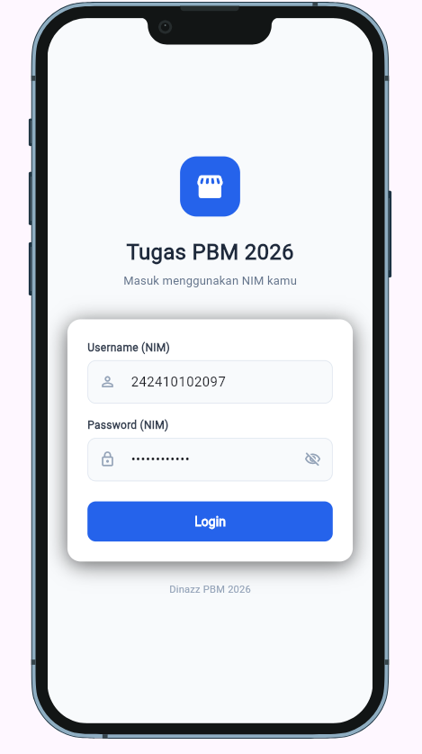
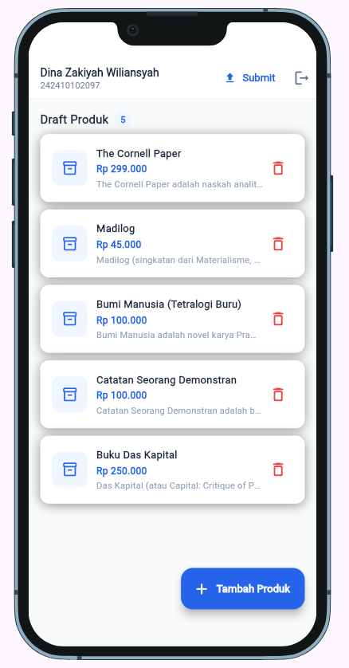
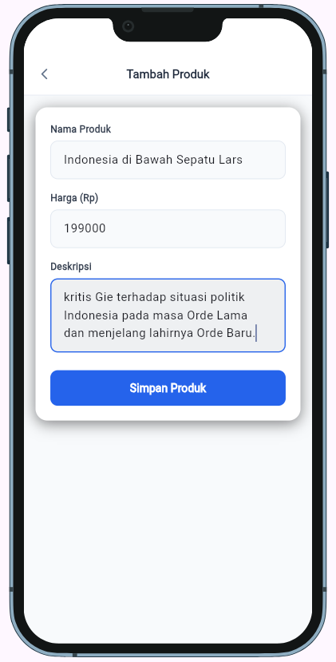

# Tugas Praktikum - Pemrograman Berbasis Mobile 2026

Aplikasi Flutter untuk tugas praktikum Pemrograman Berbasis Mobile 2026.

## Identitas

| | |
|---|---|
| **Nama** | Dina Zakiyah Wiliansyah |
| **NIM** | 242410102097 |
| **Kelas** | TI-B |

---

## Fitur Aplikasi

- Login menggunakan NIM
- Menampilkan katalog produk
- Menambahkan draft produk
- Menghapus produk (soft delete)
- Submit tugas

---

## Teknologi

- Flutter
- Dart
- REST API (Bearer Token)
- flutter_secure_storage
- http

---

## Screenshot

### Halaman Login


### Halaman Katalog Produk


### Halaman Tambah Produk



---

## Cara Menjalankan

1. Clone repository ini
```bash
git clone [https://github.com/username/nama-repo.git](https://github.com/Dinazakiyah/242410102097_Dina-Zakiyah-w_TugasPBM.git)
```

2. Install dependencies
```bash
flutter pub get
```

3. Jalankan aplikasi
```bash
flutter run
```
